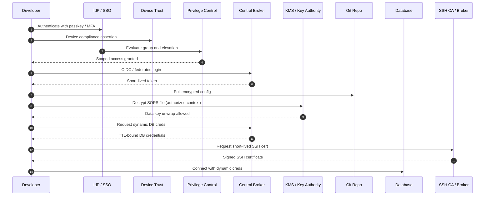

# Developer Credential Flow

```mermaid
sequenceDiagram
  autonumber
  participant Dev as Developer
  participant IdP as IdP / SSO
  participant MDM as Device Trust
  participant PIM as Privilege Control
  participant Vault as Central Broker
  participant KMS as KMS / Key Authority
  participant Git as Git Repo
  participant DB as Database
  participant SSH as SSH CA / Broker

  Dev->>IdP: Authenticate with passkey / MFA
  Dev->>MDM: Device compliance assertion
  IdP->>PIM: Evaluate group and elevation
  PIM-->>Dev: Scoped access granted
  Dev->>Vault: OIDC / federated login
  Vault-->>Dev: Short-lived token
  Dev->>Git: Pull encrypted config
  Dev->>KMS: Decrypt SOPS file (authorized context)
  KMS-->>Dev: Data key unwrap allowed
  Dev->>Vault: Request dynamic DB creds
  Vault-->>Dev: TTL-bound DB credentials
  Dev->>SSH: Request short-lived SSH cert
  SSH-->>Dev: Signed SSH certificate
  Dev->>DB: Connect with dynamic creds
```
