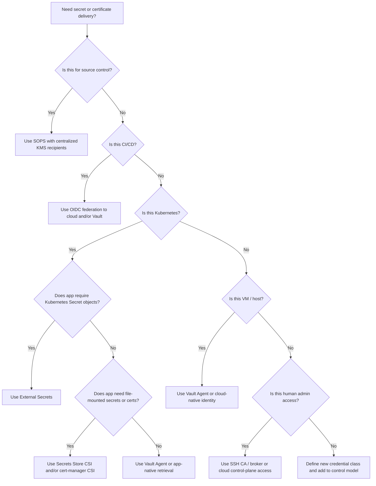

# Decision Tree

```mermaid
flowchart TD
  A[Need secret or certificate delivery?] --> B{Is this for source control?}
  B -->|Yes| C[Use SOPS with centralized KMS recipients]
  B -->|No| D{Is this CI/CD?}

  D -->|Yes| E[Use OIDC federation to cloud and/or Vault]
  D -->|No| F{Is this Kubernetes?}

  F -->|Yes| G{Does app require Kubernetes Secret objects?}
  G -->|Yes| H[Use External Secrets]
  G -->|No| I{Does app need file-mounted secrets or certs?}
  I -->|Yes| J[Use Secrets Store CSI and/or cert-manager CSI]
  I -->|No| K[Use Vault Agent or app-native retrieval]

  F -->|No| L{Is this VM / host?}
  L -->|Yes| M[Use Vault Agent or cloud-native identity]
  L -->|No| N{Is this human admin access?}
  N -->|Yes| O[Use SSH CA / broker or cloud control-plane access]
  N -->|No| P[Define new credential class and add to control model]
```
