```mermaid
graph TD
    ROOT["Compromise a<br/>Production Secret"]

    ROOT --> SC["1. Extract from<br/>Source Control"]
    ROOT --> CI["2. Extract from<br/>CI/CD Pipeline"]
    ROOT --> RT["3. Extract from<br/>Runtime"]
    ROOT --> SE["4. Social Engineering<br/>/ Insider"]
    ROOT --> VD["5. Compromise<br/>Vault Directly"]
    ROOT --> SCA["6. Supply Chain<br/>Attack"]

    SC --> SC1["1.1 Plaintext<br/>in commit"]
    SC --> SC2["1.2 Decrypt<br/>SOPS file"]
    SC --> SC3["1.3 Git history<br/>persistence"]

    SC1 --> SC1a["1.1.1 Bypass<br/>pre-commit hooks"]
    SC1 --> SC1b["1.1.2 Regex<br/>gap"]
    SC1 --> SC1c["1.1.3 Binary<br/>embedding"]

    SC2 --> SC2a["1.2.1 Laptop<br/>key theft"]
    SC2 --> SC2b["1.2.2 Break-glass<br/>key breach"]
    SC2 --> SC2c["1.2.3 KMS IAM<br/>escalation"]

    CI --> CI1["2.1 Read CI<br/>env/logs"]
    CI --> CI2["2.2 Abuse OIDC<br/>trust"]

    CI1 --> CI1a["2.1.1 Inject<br/>exfil step"]
    CI1 --> CI1b["2.1.2 Debug<br/>log leak"]
    CI1 --> CI1c["2.1.3 CI admin<br/>access"]

    CI2 --> CI2a["2.2.1 Broad<br/>subject claim"]
    CI2 --> CI2b["2.2.2 Fork<br/>OIDC inherit"]

    RT --> RT1["3.1 Read K8s<br/>Secrets"]
    RT --> RT2["3.2 Intercept<br/>Vault token"]
    RT --> RT3["3.3 Memory<br/>dump"]

    RT1 --> RT1a["3.1.1 RBAC<br/>misconfiguration"]
    RT1 --> RT1b["3.1.2 Compromised<br/>pod"]
    RT1 --> RT1c["3.1.3 etcd<br/>backup"]

    SE --> SE1["4.1 Coerce<br/>developer"]
    SE --> SE2["4.2 Malicious<br/>insider"]
    SE --> SE3["4.3 Vendor<br/>compromise"]

    VD --> VD1["5.1 Vault<br/>CVE"]
    VD --> VD2["5.2 Root<br/>token theft"]
    VD --> VD3["5.3 Unseal key<br/>compromise"]

    SCA --> SCA1["6.1 Malicious<br/>dependency"]
    SCA --> SCA2["6.2 Trojanized<br/>base image"]
    SCA --> SCA3["6.3 Compromised<br/>binary"]

    classDef high fill:#ff6b6b,stroke:#c92a2a,color:#fff
    classDef medium fill:#ffa94d,stroke:#e8590c,color:#fff
    classDef low fill:#74c0fc,stroke:#1971c2,color:#fff
    classDef verylow fill:#b2f2bb,stroke:#2f9e44,color:#000

    class SC1a,CI1b,SCA1 medium
    class SC1b,SC1c,SC2c,CI1c,CI2b,RT1c,RT3,SE1,VD1,SCA2 low
    class SC2b,SC3,RT2,VD2,VD3,SCA3 verylow
    class SC2a,CI1a,CI2a,RT1a,RT1b,SE2,SE3,RT2 medium
```

```mermaid
graph TD
    ROOT["Escalate from<br/>CI to Production"]

    ROOT --> OIDC["1. OIDC Federation<br/>Misconfiguration"]
    ROOT --> PIV["2. Pivot via<br/>CI Secrets"]
    ROOT --> ART["3. Tamper with<br/>Deployment Artifact"]
    ROOT --> RUN["4. Abuse CI<br/>Runner Infra"]
    ROOT --> CHAIN["5. Chain CI +<br/>Identity Escalation"]

    OIDC --> O1["1.1 No branch<br/>restriction"]
    OIDC --> O2["1.2 No env<br/>protection"]
    OIDC --> O3["1.3 Audience<br/>not validated"]

    PIV --> P1["2.1 Ambient<br/>cloud creds"]
    PIV --> P2["2.2 Prod password<br/>in CI store"]
    PIV --> P3["2.3 Shared<br/>AppRole"]

    ART --> A1["3.1 Tag<br/>replacement"]
    ART --> A2["3.2 Build cache<br/>poisoning"]
    ART --> A3["3.3 Deploy config<br/>tampering"]

    RUN --> R1["4.1 Container<br/>escape"]
    RUN --> R2["4.2 Multi-tenant<br/>leak"]
    RUN --> R3["4.3 Runner<br/>persistence"]

    CHAIN --> C1["5.1 Token<br/>escalation"]
    CHAIN --> C2["5.2 IAM role<br/>chain"]
    CHAIN --> C3["5.3 kubectl<br/>to prod"]

    classDef high fill:#ff6b6b,stroke:#c92a2a,color:#fff
    classDef medium fill:#ffa94d,stroke:#e8590c,color:#fff
    classDef low fill:#74c0fc,stroke:#1971c2,color:#fff
    classDef verylow fill:#b2f2bb,stroke:#2f9e44,color:#000

    class O1,O2,P3,A1,A3,C3 medium
    class O3,P1,P2,A2,R1,R2,C1,C2 low
    class R3 verylow
```

```mermaid
graph TD
    ROOT["Bypass Secret<br/>Rotation"]

    ROOT --> MECH["1. Rotation<br/>Mechanism Failure"]
    ROOT --> SCOPE["2. Scope Gap in<br/>Rotation Policy"]
    ROOT --> CONS["3. Consumer Holds<br/>Old Credential"]
    ROOT --> DUAL["4. Dual-Valid<br/>Window"]

    MECH --> M1["1.1 Silent<br/>script failure"]
    MECH --> M2["1.2 Lease falls<br/>back to static"]
    MECH --> M3["1.3 SOPS re-encrypt<br/>skipped"]
    MECH --> M4["1.4 Cert renewal<br/>misconfigured"]

    SCOPE --> S1["2.1 Untracked<br/>secret"]
    SCOPE --> S2["2.2 Third-party<br/>key manual"]
    SCOPE --> S3["2.3 Legacy app<br/>cannot rotate"]
    SCOPE --> S4["2.4 Break-glass<br/>not rotated"]

    CONS --> C1["3.1 App caches<br/>past TTL"]
    CONS --> C2["3.2 CI pinned<br/>to old secret"]
    CONS --> C3["3.3 K8s Secret<br/>stale"]
    CONS --> C4["3.4 Expired<br/>token valid"]

    DUAL --> D1["4.1 Grace period<br/>both valid"]
    DUAL --> D2["4.2 Old DB<br/>sessions persist"]
    DUAL --> D3["4.3 CRL/OCSP<br/>not checked"]
    DUAL --> D4["4.4 IAM propagation<br/>delay"]

    classDef high fill:#ff6b6b,stroke:#c92a2a,color:#fff
    classDef medium fill:#ffa94d,stroke:#e8590c,color:#fff
    classDef low fill:#74c0fc,stroke:#1971c2,color:#fff
    classDef verylow fill:#b2f2bb,stroke:#2f9e44,color:#000

    class S1,S2 high
    class M1,M3,M4,S3,C1,C3,C4,D1,D2,D3 medium
    class M2,S4,C2,D4 low
```

```mermaid
graph TD
    ROOT["Exfiltrate Secrets<br/>via Side Channel"]

    ROOT --> LOG["1. Log-Based<br/>Exfiltration"]
    ROOT --> NET["2. Network-Based<br/>Exfiltration"]
    ROOT --> ART["3. Artifact-Based<br/>Exfiltration"]
    ROOT --> TIM["4. Timing and<br/>Inference"]
    ROOT --> CLI["5. Clipboard and<br/>Terminal"]

    LOG --> L1["1.1 Debug<br/>log leak"]
    LOG --> L2["1.2 Vault audit<br/>log path"]
    LOG --> L3["1.3 CI env var<br/>in build log"]
    LOG --> L4["1.4 K8s event<br/>stream"]

    NET --> N1["2.1 DNS<br/>exfiltration"]
    NET --> N2["2.2 Outbound<br/>HTTP"]
    NET --> N3["2.3 Error<br/>response leak"]
    NET --> N4["2.4 Webhook<br/>callback"]

    ART --> A1["3.1 Image<br/>layer bake"]
    ART --> A2["3.2 CI artifact<br/>inclusion"]
    ART --> A3["3.3 Shared<br/>volume"]
    ART --> A4["3.4 Commit<br/>message"]

    TIM --> T1["4.1 Timing<br/>attack"]
    TIM --> T2["4.2 Error<br/>oracle"]
    TIM --> T3["4.3 Rate limit<br/>inference"]
    TIM --> T4["4.4 Resource<br/>side channel"]

    CLI --> CL1["5.1 Clipboard<br/>capture"]
    CLI --> CL2["5.2 Terminal<br/>scrollback"]
    CLI --> CL3["5.3 Screen<br/>recording"]

    classDef high fill:#ff6b6b,stroke:#c92a2a,color:#fff
    classDef medium fill:#ffa94d,stroke:#e8590c,color:#fff
    classDef low fill:#74c0fc,stroke:#1971c2,color:#fff
    classDef verylow fill:#b2f2bb,stroke:#2f9e44,color:#000

    class L1,L3 high
    class N2,N3,A1,A3,CL1,CL2 medium
    class L4,N1,N4,A2,T2,CL3 low
    class L2,A4,T1,T3,T4 verylow
```

# Attack Tree Analysis

This document provides structured attack tree analysis for the four highest-consequence threat scenarios in the secrets and identity architecture. Each tree enumerates attack paths with probability estimates, maps existing mitigations from the control framework (see `docs/06-controls-and-guardrails.md` and `docs/07-threat-model.md`), and identifies residual risk.

Mermaid diagram source files are in `diagrams/04-attack-tree-secret-compromise.mmd`.

---

## Probability Scale

| Rating | Range | Meaning |
|--------|-------|---------|
| Very Low | < 5% | Requires exceptional circumstances or multiple simultaneous failures |
| Low | 5-15% | Possible but significant barriers exist |
| Medium | 15-35% | Feasible with moderate skill or single control failure |
| High | 35-60% | Achievable with common tooling or known techniques |
| Very High | > 60% | Trivial or frequently observed in the wild |

---

## Tree 1: Compromise a Production Secret

**Root Goal:** Attacker obtains a valid production secret (database credential, API key, cloud access key, or TLS private key) that grants access to production systems.

### Text-Based Attack Tree

```
[ROOT] Compromise a Production Secret
├── [AND] 1. Extract from source control
│   ├── [OR] 1.1 Secret committed in plaintext
│   │   ├── 1.1.1 Developer bypasses pre-commit hooks (--no-verify)
│   │   ├── 1.1.2 Secret type not covered by gitleaks regex
│   │   └── 1.1.3 Secret embedded in non-scanned file type (binary, image)
│   ├── [OR] 1.2 Decrypt SOPS-encrypted file
│   │   ├── 1.2.1 Compromise developer age private key (laptop theft, malware)
│   │   ├── 1.2.2 Compromise break-glass age key (physical safe breach)
│   │   └── 1.2.3 Obtain cloud KMS decrypt permission (IAM escalation)
│   └── 1.3 Secret persists in Git history after rotation
│
├── [AND] 2. Extract from CI/CD pipeline
│   ├── [OR] 2.1 Read CI environment variables or logs
│   │   ├── 2.1.1 Inject malicious workflow step that exfiltrates env vars
│   │   ├── 2.1.2 Secret leaked to build log output (debug mode, error trace)
│   │   └── 2.1.3 Access CI platform admin console (stolen PAT, SSO bypass)
│   └── [OR] 2.2 Abuse OIDC federation trust
│       ├── 2.2.1 Create branch matching overly broad subject claim filter
│       └── 2.2.2 Fork repo and trigger workflow with inherited OIDC trust
│
├── [AND] 3. Extract from runtime environment
│   ├── [OR] 3.1 Read Kubernetes Secret objects
│   │   ├── 3.1.1 RBAC misconfiguration grants cross-namespace read
│   │   ├── 3.1.2 Compromised pod with mounted service account token
│   │   └── 3.1.3 etcd backup accessed without encryption at rest
│   ├── [OR] 3.2 Intercept Vault lease or token
│   │   ├── 3.2.1 Token logged in application debug output
│   │   └── 3.2.2 Network interception (missing mTLS on Vault connection)
│   └── 3.3 Memory dump of running process holding secret
│
├── [AND] 4. Social engineering / insider
│   ├── 4.1 Coerce developer with production access to reveal secret
│   ├── 4.2 Malicious insider with legitimate Vault access exports secrets
│   └── 4.3 Third-party vendor with delegated access is compromised
│
├── [AND] 5. Compromise Vault directly
│   ├── 5.1 Exploit Vault software vulnerability (CVE)
│   ├── 5.2 Steal Vault root token (if one exists)
│   └── 5.3 Unseal keys obtained (3-of-5 Shamir threshold met)
│
└── [AND] 6. Supply chain attack
    ├── 6.1 Compromised dependency exfiltrates env vars at build time
    ├── 6.2 Malicious container base image with backdoor
    └── 6.3 Compromised SOPS/Vault binary replaced with trojanized version
```

### Probability and Mitigation Matrix

| Leaf Node | Probability | Existing Mitigations | Residual Risk |
|-----------|-------------|---------------------|---------------|
| 1.1.1 Developer bypasses hooks | Medium | Pre-commit hooks (C1), CI scanning as backstop | Medium -- `--no-verify` cannot be prevented client-side |
| 1.1.2 Regex gap in scanner | Low | Gitleaks with custom patterns, GitHub Advanced Security | Low -- periodic regex audit reduces gap |
| 1.1.3 Binary/image embedding | Very Low | Entropy scanning (`tools/scanning/enhanced-scan`), file size anomaly detection | Low -- non-standard vector but hard to detect |
| 1.2.1 Laptop key compromise | Medium | MDM, disk encryption, short-lived dev credentials | Medium -- key at rest on developer machine |
| 1.2.2 Break-glass key breach | Very Low | Shamir 3-of-5, physical safes, ceremony protocol (`docs/15-sops-bootstrap-guide.md`) | Very Low -- physical + split custody |
| 1.2.3 Cloud KMS IAM escalation | Low | IAM policy scoping, CloudTrail/audit logs, separate KMS admin from SOPS user | Low -- IAM defense in depth |
| 1.3 Git history persistence | Medium | BFG/filter-repo in playbook, force-push after rotation | Medium -- window between commit and discovery |
| 2.1.1 Malicious workflow step | Medium | Branch protection, required reviews, CODEOWNERS on workflow files | Medium -- supply chain via PR |
| 2.1.2 Secret in build log | High | Log scrubbing, masked variables, CI platform secret masking | Medium -- accidental leaks still common |
| 2.1.3 CI admin access theft | Low | SSO/MFA on CI platform, PAT scoping, audit logs | Low |
| 2.2.1 Broad OIDC subject claim | Medium | Repository + branch claim restrictions (C2) | Low -- if claims are tightly scoped |
| 2.2.2 Fork inherits OIDC trust | Low | Fork restriction policies, environment protection rules | Very Low -- most platforms block this |
| 3.1.1 RBAC cross-namespace read | Medium | Namespace isolation, per-app service accounts (C3) | Medium -- RBAC drift over time |
| 3.1.2 Compromised pod | Medium | Pod security standards, network policies, mTLS | Medium -- post-compromise lateral movement |
| 3.1.3 etcd backup unencrypted | Low | etcd encryption at rest, backup access control | Low |
| 3.2.1 Token in debug logs | Medium | Audit logging policy, log scrubbing, Vault response wrapping | Medium |
| 3.2.2 Network interception | Very Low | mTLS to Vault (`docs/16-mtls-workload-identity-guide.md`), TLS everywhere | Very Low |
| 3.3 Memory dump | Low | Pod security, no privileged containers, node access control | Low |
| 4.1 Social engineering | Low | Access controls are system-enforced, no "show me the secret" path | Low |
| 4.2 Malicious insider | Low | Vault audit logging, least privilege (C3), anomaly detection | Medium -- authorized access is hard to distinguish |
| 4.3 Vendor compromise | Low | Scoped vendor access, separate trust domains, audit logs | Medium |
| 5.1 Vault CVE | Low | Timely patching, Vault Enterprise features, network segmentation | Low |
| 5.2 Root token theft | Very Low | Root token generated only during ceremony, revoked immediately after use | Very Low |
| 5.3 Unseal key compromise | Very Low | Shamir 3-of-5, physical separation, key ceremony (`docs/18-key-ceremony-guide.md`) | Very Low |
| 6.1 Malicious dependency | Medium | Dependency scanning, lockfiles, SCA tools | Medium -- detection lag |
| 6.2 Malicious base image | Low | Image scanning, signed base images, pinned digests | Low |
| 6.3 Trojanized binary | Very Low | Checksum verification, signed releases, install from official sources | Very Low |

### Mermaid Diagram



---

## Tree 2: Escalate from CI to Production

**Root Goal:** Attacker with access to a CI pipeline (via PR, compromised runner, or stolen CI credentials) escalates to production-level access.

### Text-Based Attack Tree

```
[ROOT] Escalate from CI to Production
├── [OR] 1. Abuse OIDC federation misconfiguration
│   ├── 1.1 Subject claim allows any branch (missing branch restriction)
│   ├── 1.2 Environment protection rules not enforced
│   └── 1.3 OIDC audience/issuer not validated on Vault side
│
├── [OR] 2. Pivot from CI secret to production system
│   ├── 2.1 CI runner has ambient cloud credentials with production scope
│   ├── 2.2 CI secret store contains production database password
│   └── 2.3 Shared Vault AppRole used for both staging and prod
│
├── [OR] 3. Tamper with deployment artifact
│   ├── 3.1 Replace container image tag (no digest pinning)
│   ├── 3.2 Inject code into build output (compromised build cache)
│   └── 3.3 Modify Helm values / Kustomize overlays in deployment pipeline
│
├── [OR] 4. Abuse CI runner infrastructure
│   ├── 4.1 Escape self-hosted runner container to host
│   ├── 4.2 Access other tenants' secrets on shared runner
│   └── 4.3 Persist backdoor on self-hosted runner between jobs
│
└── [OR] 5. Chain CI access with identity escalation
    ├── 5.1 CI-generated token exchanged for broader Vault policy
    ├── 5.2 CI service account has IAM role assumption to prod
    └── 5.3 CI pipeline has kubectl access to production namespace
```

### Probability and Mitigation Matrix

| Leaf Node | Probability | Existing Mitigations | Residual Risk |
|-----------|-------------|---------------------|---------------|
| 1.1 No branch restriction | Medium | OIDC claim scoping (C2), per-branch trust conditions | Medium -- configuration drift risk |
| 1.2 No environment protection | Medium | Environment-scoped roles, required reviewers | Medium -- depends on platform config |
| 1.3 Audience not validated | Low | Vault JWT auth `bound_audiences` config | Low -- standard Vault config |
| 2.1 Ambient cloud credentials | Medium | OIDC federation replaces static creds (C2), no long-lived keys | Low -- if OIDC is fully adopted |
| 2.2 Prod password in CI store | Low | Environment separation (C3), secret path segregation | Low -- architectural control |
| 2.3 Shared AppRole | Medium | Per-environment Vault roles, policy scoping | Medium -- common misconfiguration |
| 3.1 Image tag replacement | Medium | Image signing (`tools/signing/`), digest pinning, admission control | Low -- if signing is enforced |
| 3.2 Build cache poisoning | Low | Reproducible builds, cache integrity checks | Medium -- hard to detect |
| 3.3 Deployment config tampering | Medium | Branch protection, CODEOWNERS, GitOps with drift detection | Low -- if GitOps is enforced |
| 4.1 Runner container escape | Low | Ephemeral runners, hardened images, no privileged mode | Low |
| 4.2 Multi-tenant runner leak | Low | Runner isolation per repo/org, ephemeral runners | Low |
| 4.3 Runner persistence | Medium | Ephemeral runners destroy state between jobs | Very Low -- if ephemeral |
| 5.1 Token escalation | Low | Vault policy ceiling, no wildcard paths | Low |
| 5.2 IAM role chain to prod | Low | SCP/permission boundaries, separate prod accounts | Low |
| 5.3 kubectl to prod namespace | Medium | RBAC scoping, network policies, separate kubeconfigs per env | Medium |

### Mermaid Diagram



---

## Tree 3: Bypass Secret Rotation

**Root Goal:** A secret that should have been rotated remains valid and usable beyond its intended lifecycle, creating a persistent access vector.

### Text-Based Attack Tree

```
[ROOT] Bypass Secret Rotation
├── [OR] 1. Rotation mechanism failure
│   ├── 1.1 Rotation script fails silently (no alerting on failure)
│   ├── 1.2 Vault dynamic secret lease not renewed, falls back to static
│   ├── 1.3 SOPS re-encryption skipped after recipient removal
│   └── 1.4 Certificate auto-renewal disabled or misconfigured
│
├── [OR] 2. Scope gap in rotation policy
│   ├── 2.1 Secret exists outside Vault (env var, config file) and is not tracked
│   ├── 2.2 Third-party API key rotation not automated
│   ├── 2.3 Legacy application cannot accept rotated credential without restart
│   └── 2.4 Break-glass materials not rotated after drill or real use
│
├── [OR] 3. Consumer still holds old credential
│   ├── 3.1 Application caches credential in memory beyond TTL
│   ├── 3.2 CI pipeline pinned to old secret version
│   ├── 3.3 Kubernetes Secret object not refreshed after Vault rotation
│   └── 3.4 Developer workstation holds expired but still-valid token
│
└── [OR] 4. Rotation creates dual-valid window
    ├── 4.1 Old credential not revoked during rotation grace period
    ├── 4.2 Database user password changed but old sessions persist
    ├── 4.3 Certificate revocation (CRL/OCSP) not checked by relying parties
    └── 4.4 Cloud IAM key deactivation delayed by propagation
```

### Probability and Mitigation Matrix

| Leaf Node | Probability | Existing Mitigations | Residual Risk |
|-----------|-------------|---------------------|---------------|
| 1.1 Silent rotation failure | Medium | `tools/secrets-doctor/` health checks, monitoring/alerting | Medium -- requires active monitoring |
| 1.2 Lease fallback to static | Low | Vault lease enforcement, no static fallback by policy | Low |
| 1.3 SOPS re-encryption skipped | Medium | `tools/rotate/rotate_sops_keys.sh`, documented runbook | Medium -- human step |
| 1.4 Cert renewal misconfigured | Medium | Certificate lifecycle monitoring, `secrets-doctor` checks | Medium |
| 2.1 Untracked secret | High | `tools/audit/` identity inventory, NHI scanning | Medium -- discovery gap |
| 2.2 Third-party key not automated | High | Runbook exists but manual process | High -- common gap |
| 2.3 Legacy app cannot rotate | Medium | Documented exception with compensating controls | Medium |
| 2.4 Break-glass not rotated | Low | Quarterly drill checklist, post-event rotation checklist | Low |
| 3.1 App caches past TTL | Medium | Application-level TTL enforcement, Vault lease revocation | Medium |
| 3.2 CI pinned to old secret | Low | Dynamic secret fetching in CI, no hardcoded versions | Low |
| 3.3 K8s Secret stale | Medium | External Secrets refresh interval, reconciliation loop | Medium |
| 3.4 Expired token still valid | Medium | Short TTLs, Vault token revocation on logout | Medium |
| 4.1 Grace period dual-valid | Medium | Immediate old-credential revocation in rotation scripts | Medium |
| 4.2 Old DB sessions persist | Medium | Connection pool recycling, `max_connections` TTL | Medium |
| 4.3 CRL/OCSP not checked | Medium | OCSP stapling, short-lived certs reduce window | Medium |
| 4.4 IAM propagation delay | Low | Cloud-specific propagation (typically < 60s) | Low |

### Mermaid Diagram



---

## Tree 4: Exfiltrate Secrets via Side Channel

**Root Goal:** Attacker extracts secret material without directly accessing the secret store, using indirect or side-channel methods.

### Text-Based Attack Tree

```
[ROOT] Exfiltrate Secrets via Side Channel
├── [OR] 1. Log-based exfiltration
│   ├── 1.1 Application logs secret value at debug/trace level
│   ├── 1.2 Vault audit log contains request with secret in path
│   ├── 1.3 CI build log captures environment variable expansion
│   └── 1.4 Kubernetes event stream reveals secret mount details
│
├── [OR] 2. Network-based exfiltration
│   ├── 2.1 DNS exfiltration (encode secret in DNS queries)
│   ├── 2.2 Outbound HTTP from compromised pod carrying secret payload
│   ├── 2.3 Secret included in error response returned to client
│   └── 2.4 Webhook or callback configured to external endpoint
│
├── [OR] 3. Artifact-based exfiltration
│   ├── 3.1 Secret baked into container image layer
│   ├── 3.2 Secret included in CI artifact (test report, coverage output)
│   ├── 3.3 Secret written to shared volume or temp directory
│   └── 3.4 Secret embedded in code commit message or PR description
│
├── [OR] 4. Timing and inference attacks
│   ├── 4.1 Timing differences reveal secret length or value
│   ├── 4.2 Error messages distinguish valid from invalid credentials
│   ├── 4.3 Rate limiting behavior reveals authentication boundary
│   └── 4.4 Resource consumption patterns reveal secret operations
│
└── [OR] 5. Clipboard and terminal exfiltration
    ├── 5.1 Developer copies secret to clipboard (clipboard manager captures)
    ├── 5.2 Terminal scrollback buffer contains secret
    └── 5.3 Screen sharing or recording captures secret display
```

### Probability and Mitigation Matrix

| Leaf Node | Probability | Existing Mitigations | Residual Risk |
|-----------|-------------|---------------------|---------------|
| 1.1 Debug log leak | High | Structured logging policy, no secret in log assertion | Medium -- requires discipline |
| 1.2 Vault audit log path | Low | Vault HMAC-hashes sensitive values in audit log | Very Low |
| 1.3 CI env var in build log | High | CI platform secret masking, log scrubbing | Medium -- masking has bypass edge cases |
| 1.4 K8s event stream | Low | RBAC on events, secret names are non-sensitive | Low |
| 2.1 DNS exfiltration | Low | Network policies, DNS monitoring, egress filtering | Low -- requires network controls |
| 2.2 Outbound HTTP | Medium | Egress network policies, pod-level firewall rules | Medium -- depends on network policy maturity |
| 2.3 Error response leak | Medium | Error handling standards, never return raw credentials | Medium |
| 2.4 Webhook to external | Low | Webhook allowlisting, egress controls | Low |
| 3.1 Image layer bake | Medium | Image scanning (`tools/scanning/`), multi-stage builds, no COPY of secret files | Low -- if scanning is active |
| 3.2 CI artifact inclusion | Low | Artifact path restrictions, post-build scanning | Low |
| 3.3 Shared volume write | Medium | Volume access controls, tmpfs for secrets, no hostPath | Medium |
| 3.4 Commit message leak | Very Low | PR template review, scanner covers commit messages | Very Low |
| 4.1 Timing attack | Very Low | Constant-time comparison in auth paths | Very Low |
| 4.2 Error oracle | Low | Generic error messages for auth failures | Low |
| 4.3 Rate limit inference | Very Low | Uniform rate limiting | Very Low |
| 4.4 Resource side channel | Very Low | Noise in cloud environments makes this impractical | Very Low |
| 5.1 Clipboard capture | Medium | No durable local secrets policy, short-lived credentials | Medium -- human behavior |
| 5.2 Terminal scrollback | Medium | No `vault read` in plaintext recommended, use response wrapping | Medium |
| 5.3 Screen recording | Low | Security awareness training, screen lock policies | Low |

### Mermaid Diagram



---

## Cross-Tree Risk Summary

| Tree | Highest Residual Risk Area | Recommended Priority |
|------|--------------------------|---------------------|
| 1. Production Secret Compromise | Debug log leaks (2.1.2), untracked secrets, malicious dependencies | Strengthen CI log scrubbing, complete NHI inventory |
| 2. CI to Production Escalation | OIDC scope drift, shared AppRoles, kubectl to prod | Audit OIDC claims quarterly, enforce per-env Vault roles |
| 3. Rotation Bypass | Untracked third-party keys, silent rotation failures | Automate third-party rotation, alert on rotation script failures |
| 4. Side Channel Exfiltration | Application debug logging, CI build log masking gaps | Enforce no-secret-in-log policy, audit masking rules |

## Related Documents

- Threat model: `docs/07-threat-model.md`
- Controls and guardrails: `docs/06-controls-and-guardrails.md`
- Incident playbooks: `docs/25-incident-playbooks.md`
- Security hardening checklist: `docs/26-security-hardening-checklist.md`
- SIRM framework: `docs/19-sirm-framework.md`
- Mermaid source: `diagrams/04-attack-tree-secret-compromise.mmd`
